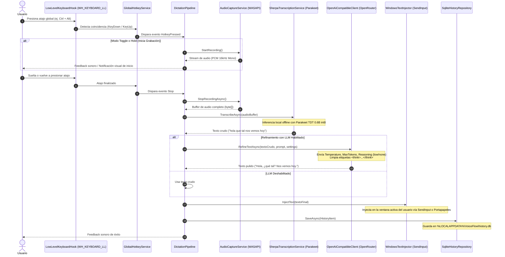
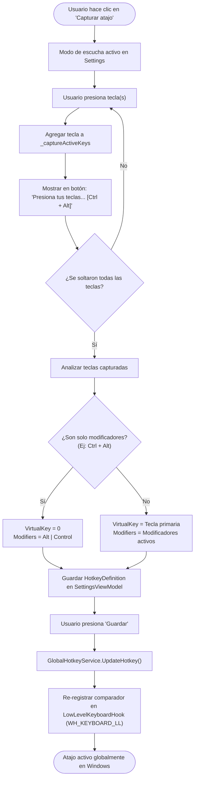
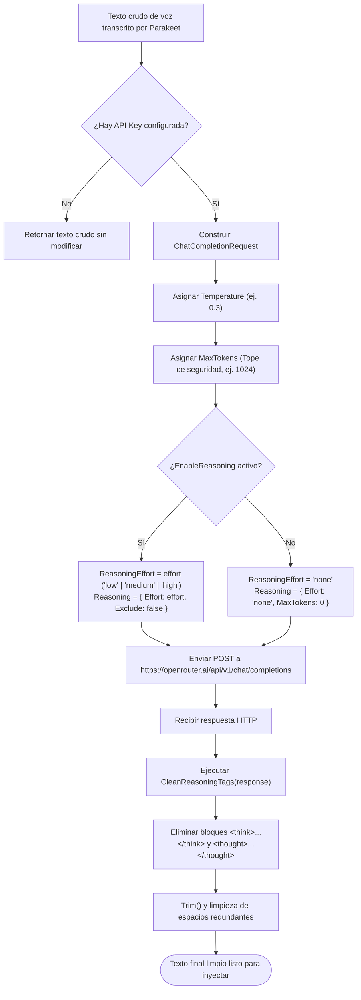
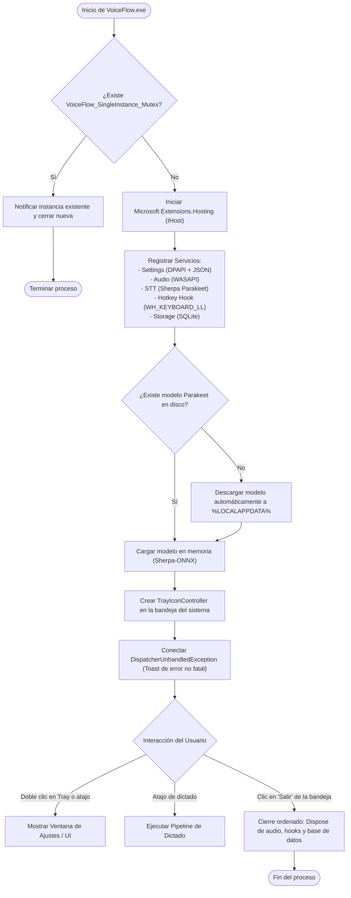

# Diagramas de Flujo del Sistema (Mermaid) - VoiceFlow

Este documento contiene la representación visual y técnica de los flujos de ejecución más importantes de **VoiceFlow** utilizando diagramas de Mermaid.

---

## 1. Pipeline Completo de Dictado por Voz

Describe el recorrido que hace el audio desde que el usuario presiona el atajo de teclado hasta que el texto refinado es inyectado en su aplicación activa.

---

## 2. Arquitectura de Comunicación IPC (WebView2 React <-> .NET Host)

Describe cómo interactúa la interfaz de usuario en React con el motor central de .NET a través del puente de WebView2.

```mermaid
sequenceDiagram
    autonumber
    participant UI as Componente React (Vite)
    participant BridgeClient as bridge.ts (Frontend IPC Facade)
    participant WebView2 as Microsoft.Web.WebView2
    participant BridgeHost as WebView2BridgeController (.NET)
    participant Dispatcher as MessageDispatcher (.NET)
    participant Services as Servicios del Sistema (Audio, LLM, Config)

    rect rgb(20, 30, 45)
    note over UI, Services: Patrón 1: Petición / Respuesta Asíncrona (Request - Response)
    UI->>BridgeClient: bridge.settings.save(newSettings)
    BridgeClient->>WebView2: window.chrome.webview.postMessage({ id: "req-1", action: "settings:save", payload: newSettings })
    WebView2->>BridgeHost: Evento WebMessageReceived
    BridgeHost->>Dispatcher: Enrutar acción "settings:save"
    Dispatcher->>Services: ISettingsService.SaveAsync(newSettings)
    Services-->>Dispatcher: Resultado exitoso
    Dispatcher->>BridgeHost: Respuesta estructurada
    BridgeHost->>WebView2: PostWebMessageAsJson({ id: "req-1", success: true, data: null })
    WebView2->>BridgeClient: Evento window.chrome.webview.addEventListener('message')
    BridgeClient-->>UI: Resuelve Promise(void)
    end

    rect rgb(25, 40, 30)
    note over UI, Services: Patrón 2: Flujo de Eventos Push en Tiempo Real (Event Stream)
    Services->>BridgeHost: Evento OnAudioLevelChanged(rms: 0.72)
    BridgeHost->>WebView2: PostWebMessageAsJson({ event: "audio:level", data: 0.72 })
    WebView2->>BridgeClient: Dispara listener registrado "audio:level"
    BridgeClient-->>UI: Actualiza estado reactivo / Anima visualizador de ondas
    end
```

---

## 3. Captura y Registro de Atajos Globales de Teclado

Detalla cómo se registran atajos en la interfaz (permitiendo combinaciones complejas como `Ctrl + Alt` sin conflicto) y cómo se vinculan con el hook global del sistema operativo.

---

## 4. Refinamiento LLM y Sanitización de Razonamiento (Thinking)

Muestra cómo se procesan las opciones de temperatura, límite máximo de longitud y cómo se filtran los pensamientos internos de modelos como DeepSeek R1 o GLM-5.

---

## 5. Ciclo de Vida de la Aplicación y Manejo del System Tray

Representa el arranque de VoiceFlow, la protección de instancia única con Mutex y el manejo de ventanas.

